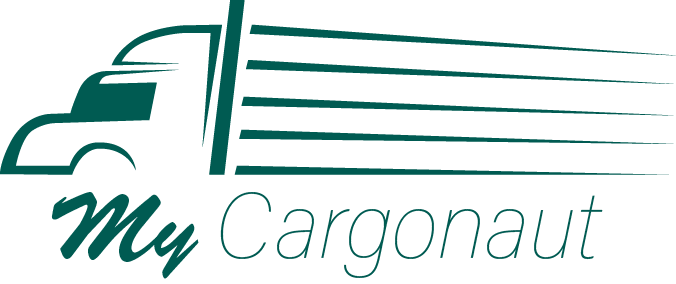

[![Contributors][contributors-shield]][contributors-url]
[![Forks][forks-shield]][forks-url]
[![Stargazers][stars-shield]][stars-url]
[![Issues][issues-shield]][issues-url]
[![MIT License][license-shield]][license-url]

<!-- PROJECT LOGO -->
 

  

  

    A brandnew unique car-sharing Webapp!
     
    <a href="https://github.com/wrth1337/MyCargonaut/tree/develop/documentation"><strong>Explore the docs »</strong></a>
     
     
    ·
    <a href="https://github.com/othneildrew/Best-README-Template/issues">Report Bug</a>
    ·
    <a href="https://github.com/othneildrew/Best-README-Template/issues">Request Feature</a>
    ·
  

Disclaimer: This project is part of the "Konzepte moderner Softwareentwicklung" module from the "Technische Hochschule Mittelhessen", led by Lukas Maximilian Kimpel. This web application, MyCargonaut, is a student initiative aimed at exploring and implementing modern software development concepts.

Welcome to MyCargonaut, your go-to platform for facilitating ride and delivery services! Our web application is designed to seamlessly connect individuals with transportation needs to those who have available space and are willing to help.

## About The Project

[![Product Name Screen Shot][product-screenshot]](https://example.com)

"My Cargonaut" is an innovative student project developed within the scope of the "Konzepte moderner Softwareentwicklung" module at the "Technische Hochschule Mittelhessen" under the guidance of Lukas Maximilian Kimpel. This web application serves as a classic car-sharing platform, empowering users to seamlessly find and offer rides.

Key-Features:
* Users can effortlessly search for available rides or offer their own, promoting a collaborative and sustainable approach to transportation.
* Enhancing user experience, "My Cargonaut" allows individuals to provide ratings for rides, fostering a sense of community trust. Additionally, the platform facilitates secure payment transactions for added convenience.
* Each user enjoys the benefits of a personalized profile, enabling them to manage their ride history, preferences, and other relevant details, contributing to a tailored and user-centric experience.

(<a href="#readme-top">back to top</a>)

## Installation
- Clone Repository
- Go to frontend/mycargonaut and run npm i
- Go to backend and run npm i
### Frontend
#### Start
- ng serve
#### Test
- ng test
#### Lint
- ng lint / npm run lint
### Backend
#### Start
- npm run dev
#### Test
- npm run test
#### Lint
- npx eslint .
### Start Database
- docker compose build
- docker compose up

## Contributors
All members of "Group 2" were involved in the project.

* Marcel Kaiser     - [Gitlab](https://git.thm.de/mpks28)   - [Github](https://github.com/marcel951)
* Jonathan Rech     - [Gitlab](https://git.thm.de/jwhr06)   - [Github](https://github.com/JonathanRech)
* Benjamin Wirth    - [Gitlab](https://git.thm.de/bwrt47)   - [Github](https://github.com/wrth1337)
* Ella Maria Herr   - [Gitlab](https://git.thm.de/emhr14)
* Nicolas Daniel Binder -  [Giblab](https://git.thm.de/ndbn17)
* Hanna Feddersen   -[Gitlab](https://git.thm.de/hfdd02)

<!-- MARKDOWN LINKS & IMAGES -->
<!-- https://www.markdownguide.org/basic-syntax/#reference-style-links -->
[contributors-shield]: https://img.shields.io/github/contributors/othneildrew/Best-README-Template.svg?style=for-the-badge
[contributors-url]: https://github.com/wrth1337/MyCargonaut/graphs/contributors
[forks-shield]: https://img.shields.io/github/forks/othneildrew/Best-README-Template.svg?style=for-the-badge
[forks-url]: https://github.com/wrth1337/MyCargonaut/network/members
[stars-shield]: https://img.shields.io/github/stars/othneildrew/Best-README-Template.svg?style=for-the-badge
[stars-url]: https://github.com/wrth1337/MyCargonaut/stargazers
[issues-shield]: https://img.shields.io/github/issues/othneildrew/Best-README-Template.svg?style=for-the-badge
[issues-url]: https://github.com/wrth1337/MyCargonaut/issues
[license-shield]: https://img.shields.io/github/license/othneildrew/Best-README-Template.svg?style=for-the-badge
[license-url]: https://github.com/wrth1337/MyCargonaut/blob/develop/LICENSE
[product-screenshot]: images/screenshot.png
[Next.js]: https://img.shields.io/badge/next.js-000000?style=for-the-badge&logo=nextdotjs&logoColor=white
[Next-url]: https://nextjs.org/
[React.js]: https://img.shields.io/badge/React-20232A?style=for-the-badge&logo=react&logoColor=61DAFB
[React-url]: https://reactjs.org/
[Vue.js]: https://img.shields.io/badge/Vue.js-35495E?style=for-the-badge&logo=vuedotjs&logoColor=4FC08D
[Vue-url]: https://vuejs.org/
[Angular.io]: https://img.shields.io/badge/Angular-DD0031?style=for-the-badge&logo=angular&logoColor=white
[Angular-url]: https://angular.io/
[Svelte.dev]: https://img.shields.io/badge/Svelte-4A4A55?style=for-the-badge&logo=svelte&logoColor=FF3E00
[Svelte-url]: https://svelte.dev/
[Laravel.com]: https://img.shields.io/badge/Laravel-FF2D20?style=for-the-badge&logo=laravel&logoColor=white
[Laravel-url]: https://laravel.com
[Bootstrap.com]: https://img.shields.io/badge/Bootstrap-563D7C?style=for-the-badge&logo=bootstrap&logoColor=white
[Bootstrap-url]: https://getbootstrap.com
[JQuery.com]: https://img.shields.io/badge/jQuery-0769AD?style=for-the-badge&logo=jquery&logoColor=white
[JQuery-url]: https://jquery.com 
