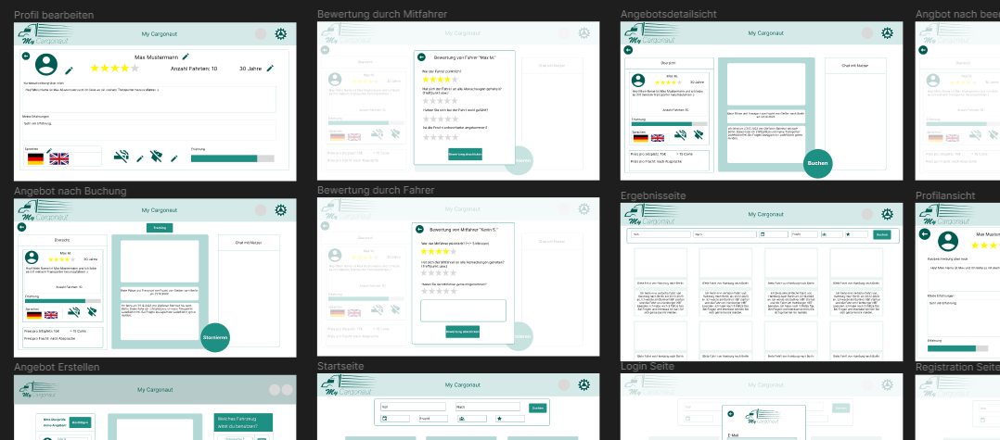

# Projektübersicht
## Technologie Auswahl
##### **Frontend**: Angular
##### **Backend**: ExpressJS
##### **Database**: MariaDB
##### **Documentation**: Swagger
##### **Testing**: Jest für Backend ; Karma/Jasmin für Frontend

##### **CI/CD-Pipeline:**
* **Bei Commit**: ESLint für <a href="https://github.com/wrth1337/MyCargonaut/blob/develop/.github/workflows/Lint_Frontend.yml">Front-</a> und <a href="https://github.com/wrth1337/MyCargonaut/blob/develop/.github/workflows/Lint_Backend.yml">Backend</a>
* **Bei Pull-Request:**
  <ul>
   <li><a href="https://github.com/wrth1337/MyCargonaut/blob/develop/.github/workflows/Frontend%20tests.yml">Frontendtests via Jasmin/Karma</a></li>
   <li><a href="https://github.com/wrth1337/MyCargonaut/blob/develop/.github/workflows/Backend%20tests.yml">Backendtests via Jest</a></li>
   <li><a href="https://github.com/wrth1337/MyCargonaut/blob/develop/.github/workflows/codeql.yml">CodeQL</a></li>
   <li><a href="https://github.com/wrth1337/MyCargonaut/blob/develop/.github/workflows/dod-checker.yaml">Definition of Done</a></li>
  </ul>
* **Permanent nebenbei:** Dependabot, integriert via GitHub
  
Bei der Auswahl der Tools, welche in der Pipeline verwendet werden, wurde sich an den einzelnen CI/CD-Phasen aus der Vorlesung orientiert.
Daher lassen sich die Tools den einzelnen Phasen zuordnen:
* **Commit-Phase:** Linting und Testing
* **Report-Phase:** CodeQL
* **UAT-Phase:** Definition of Done
* **SAT-Phase:** Dependabot, CodeQL
* **Deploy-Phase:** Building a Docker-Container from master branch
## Designs
### Wireframe

 https://www.figma.com/file/KKf76zk0DRwQwSF8pQnTUf/MyCargonaut---Wireframe?type=design&node-id=0-1&mode=design

### Mockup
https://www.figma.com/file/KKf76zk0DRwQwSF8pQnTUf/MyCargonaut---Wireframe?type=design&node-id=93-2&mode=design

## Entity Relationship Diagramm

 
 
 
 
 
 

# Entwicklungsumgebung einrichten
## Setup für Entwickler
Um die Entwicklungsumgebung für dieses Projekt einzurichten, folgen Sie bitte den unten aufgeführten Schritten:

1. **Repositorium klonen**: Klonen Sie das Repositorium auf Ihren lokalen Computer mit dem Befehl `git clone <repository-url>`. Ersetzen Sie `<repository-url>` durch die URL Ihres Repositoriums.

2. **Docker-Container erstellen**: Führen Sie den Befehl `docker-compose build` aus, um die Docker-Container für das Projekt zu erstellen.

3. **Datenbank starten**: Starten Sie nur den Datenbank-Container mit dem Befehl `docker-compose up -d database`.

4. **Frontend starten**: Wechseln Sie in das Verzeichnis `frontend/mycargonaut` und starten Sie das Frontend mit dem Befehl `ng serve`.

5. **Backend starten**: Wechseln Sie in das Backend-Verzeichnis und starten Sie das Backend mit dem Befehl `npm run dev`. Dieser Befehl verwendet Nodemon, um das Backend zu starten und automatisch neu zu starten, wenn Änderungen an den Dateien vorgenommen werden.

Bitte beachten Sie, dass Sie Node.js, npm und Docker auf Ihrem Computer installiert haben müssen, um diese Schritte ausführen zu können.

## Setup für Nutzer

Der Deployment-Prozess in diesem Projekt nutzt Docker und Docker Compose, um eine konsistente und reproduzierbare Umgebung für die Anwendung zu gewährleisten. Hier sind die Schritte, die Sie befolgen müssen, um das Projekt zu deployen:

1. **Erstellen des Docker-Images**: Führen Sie den Befehl `docker-compose build` aus, um das Docker-Image für das Projekt zu erstellen. Dieser Befehl liest die `docker-compose.yml`-Datei und erstellt Docker-Images für alle in der Datei definierten Dienste.

2. **Starten der Anwendung**: Nachdem das Docker-Image erstellt wurde, können Sie die Anwendung starten, indem Sie den Befehl `docker-compose up` ausführen. Dieser Befehl startet alle in der `docker-compose.yml`-Datei definierten Dienste in der richtigen Reihenfolge.
3. Ablauf:
   1. Navigieren in das root Directory des Projektes
   2. (sudo) docker compose build
   3. (sudo) docker compose up
   4. Über den Browser kann nun unter der URL http://localhost die Seite aufgerufen werden

Bitte beachten Sie, dass Sie Docker und Docker Compose auf Ihrem Computer installiert haben müssen, um diese Schritte ausführen zu können.

 
 
 
 
 
 

# Code-Qualität und Sicherheit
## Code Style und Linting
Die ESLint-Konfiguration für dieses Projekt ist in der Datei `.eslintrc.json` im Backend-Verzeichnis definiert. Hier ist eine Übersicht der Konfiguration:

- `env`: Definiert die Umgebungen, in denen Ihr Code ausgeführt wird. In diesem Fall sind das `browser`, `commonjs` und `es2021`.
- `extends`: Gibt an, welche Basiskonfigurationen verwendet werden. In diesem Fall wird die Google-Stilrichtlinie verwendet.
- `rules`: Definiert die Regeln, die für Ihren Code gelten. In diesem Fall sind das:
    - `indent`: Stellt sicher, dass der Code mit 4 Leerzeichen eingerückt ist.
    - `require-jsdoc`: Diese Regel ist deaktiviert (0), was bedeutet, dass JSDoc-Kommentare nicht erforderlich sind.
    - `max-len`: Begrenzt die maximale Zeilenlänge auf 165 Zeichen.
Diese Konfiguration hilft dabei, einen konsistenten Code-Stil im gesamten Projekt zu gewährleisten.

Generell wird das Clean-Code Paradigma angestrebt -> Kommentare, console.logs usw. sind nicht konform.
## Security
In diesem Projekt werden verschiedene Maßnahmen ergriffen, um die Sicherheit des Codes zu gewährleisten:

### Dependabot
Dependabot ist ein Tool von GitHub, das automatisch Pull-Anfragen erstellt, um die Dependencies in Ihrem Projekt auf den neuesten Stand zu bringen. Es überprüft täglich die Dependencies dieses Projekts auf bekannte Sicherheitslücken und erstellt bei Bedarf eine Pull-Anfrage mit der Aktualisierung.

### GitHub CodeQL Code Scan
Zusätzlich zu Dependabot wird auch GitHub CodeQL für die statische Code-Analyse verwendet. CodeQL ist ein leistungsstarkes Analysewerkzeug, das potenzielle Sicherheitslücken im Code findet und behebt. Es scannt den Code, um Muster zu finden, die auf Sicherheitslücken hinweisen könnten, und gibt Empfehlungen zur Behebung dieser Probleme.

Durch die Kombination von Dependabot und CodeQL stellen wir sicher, dass unser Code sowohl aktuell als auch sicher ist.

 
 
 
 
 
 

# Dokumentation und Tests
## API Documentation
In diesem Projekt verwenden wir Swagger zur Dokumentation unserer Backend-Routen. Swagger ist ein Open-Source-Software-Framework, das von Entwicklern weltweit genutzt wird, um APIs zu entwerfen, zu bauen und zu dokumentieren.

Mit Swagger können wir eine interaktive Dokumentation unserer API erstellen, die es Entwicklern ermöglicht, die API zu verstehen und mit ihr zu interagieren, ohne in den Code schauen zu müssen. Es bietet eine visuelle Darstellung aller API-Endpunkte, der erwarteten Anforderungen und der Antworten, die sie liefern.

Unsere API-Dokumentation ist unter der URL `backend:3000/docs` erreichbar. Dort sind detaillierte Informationen zu jeder Route, einschließlich der erwarteten Anforderungen, der Antwortstruktur und der möglichen Fehlercodes.

## Definition of Done
- 'Frontend'
  - '➡️Are all functions implemented?'
  - '➡️Are there front-end tests that test the appearance of the mockup?'
  - '➡️Do the associated components look like the mockup?'
- 'Backend'
  - '➡️Are all necessary routes documented via swagger?'
  - '➡️Are all necessary methods tested via Jest (positive and negative tests)?'
  - 'Is the user story finished to such an extent that no further work is required after the pull request (excluding hotfixes and adjustments)?'

## Test Strategie
Jede Funktion wird in sofern sinnvoll umsetzbar mit Unittests getestet. Dies gilt für sowohl Front- als auch Backend. Im Frontend wird Jasmin/Karma mit der Angular Integration genutzt, Im Backend wird Jest verwendet. Zu jeder sinnvoll zu testenden Funktion sollten mindestens zwei Unittests geschrieben werden, welche die korrekte Funktionalität der jeweiligen Funktion sicherstellt. Um zu gewährleisten, dass der Code immer alle Testansrüche erfüllt, muss dieser bei einem PullRequest über die CI/CD Pipeline alle Tests erfolgreich durchführen. 
